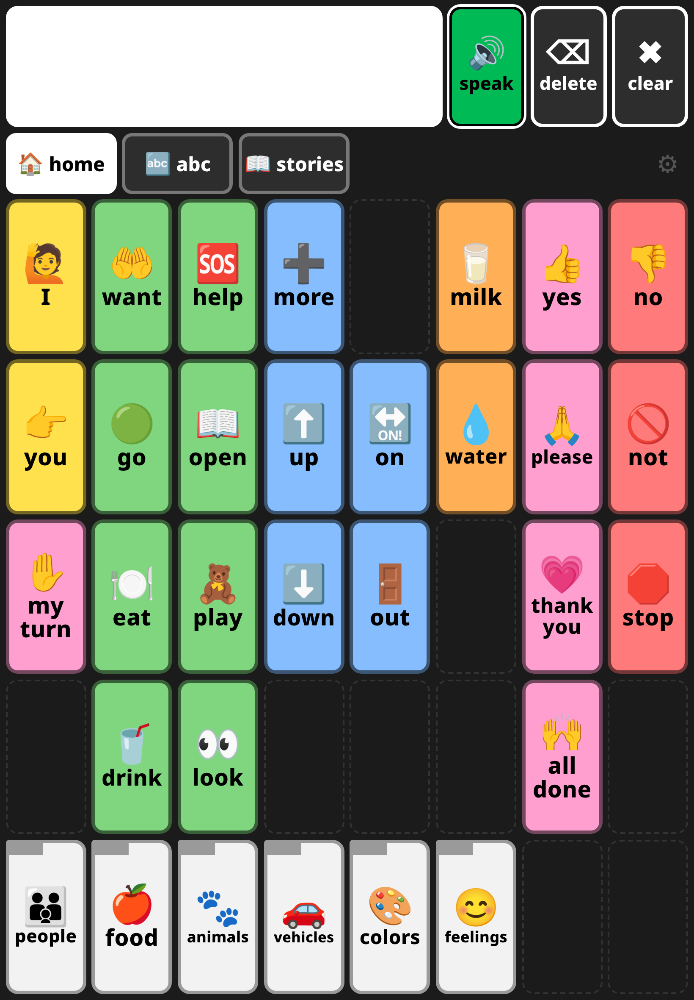
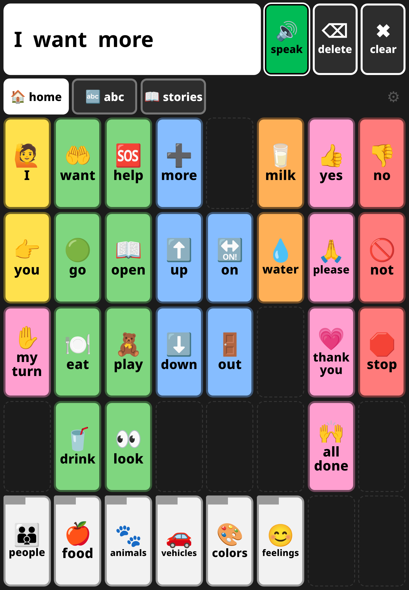
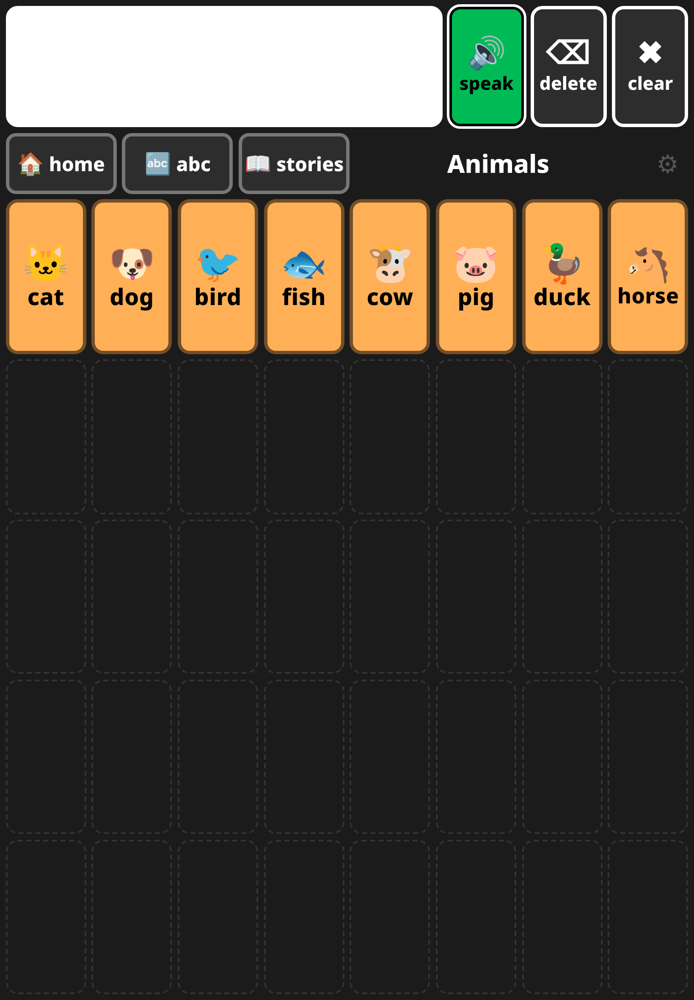
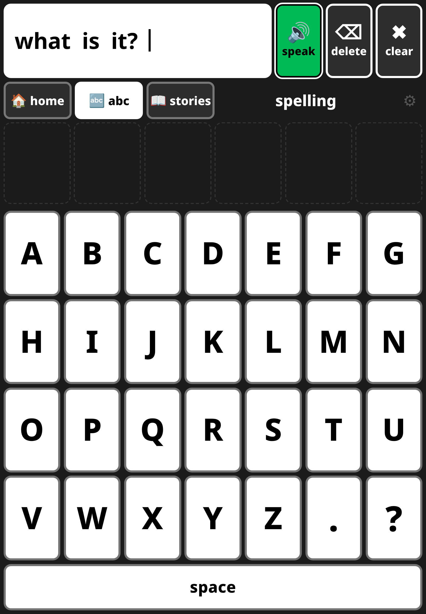
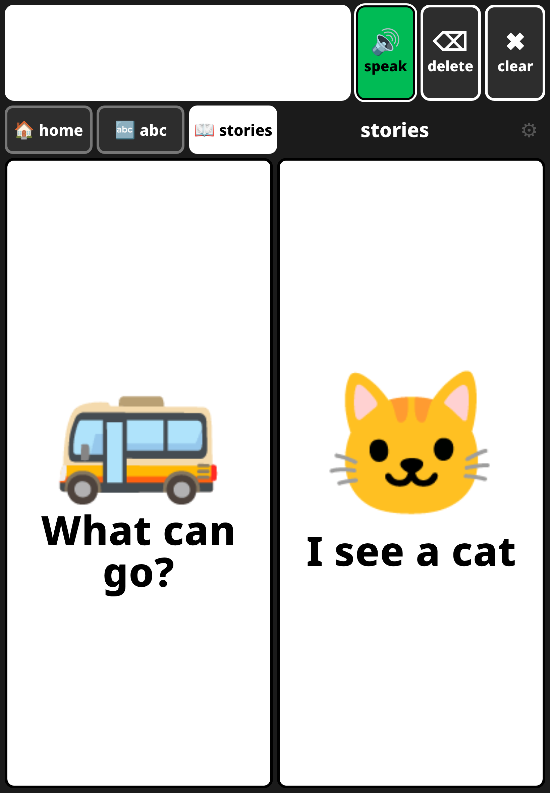
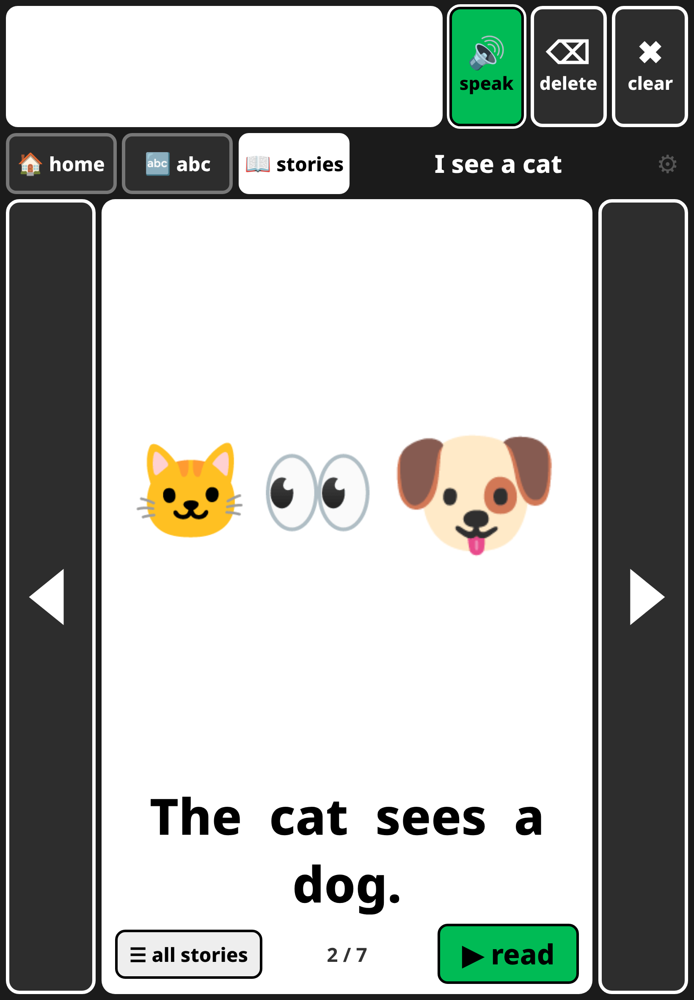
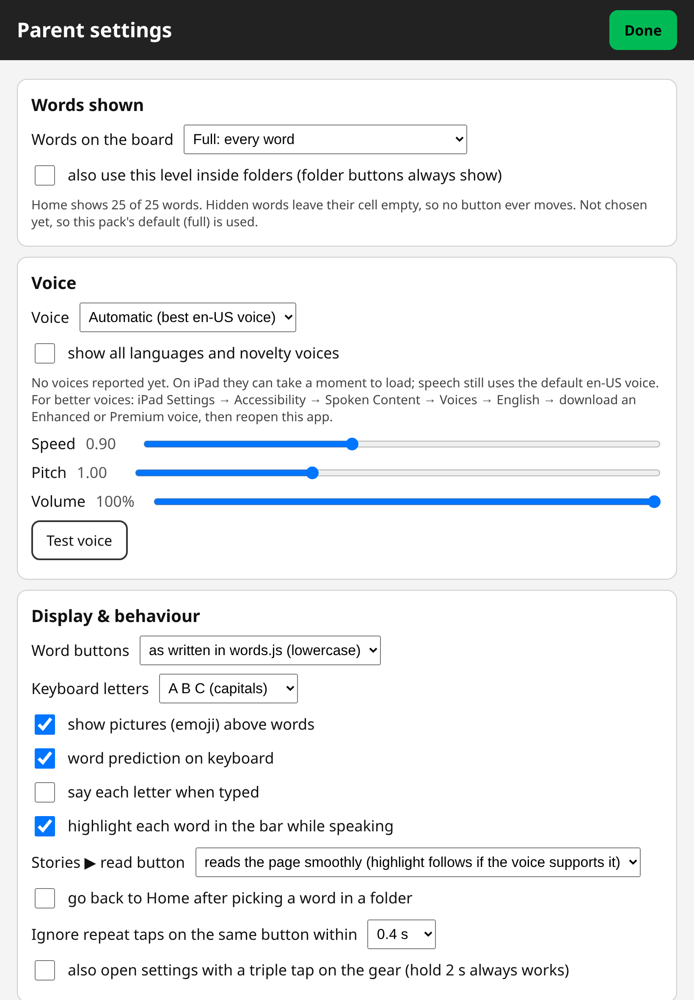
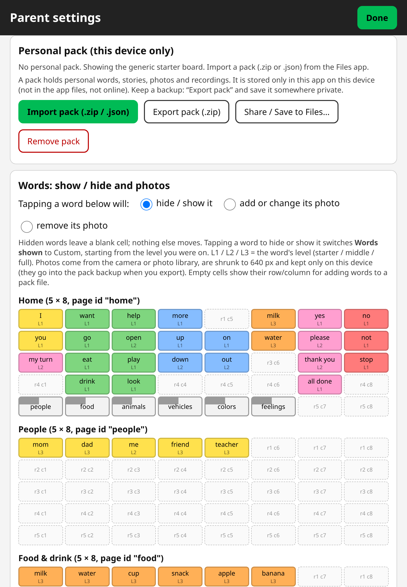
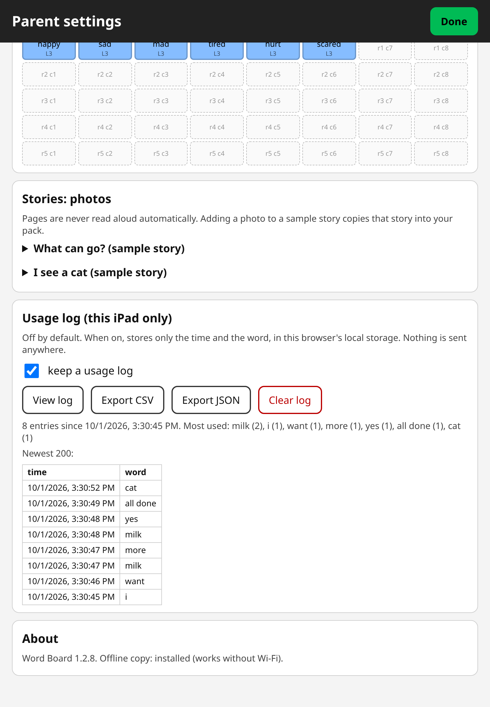
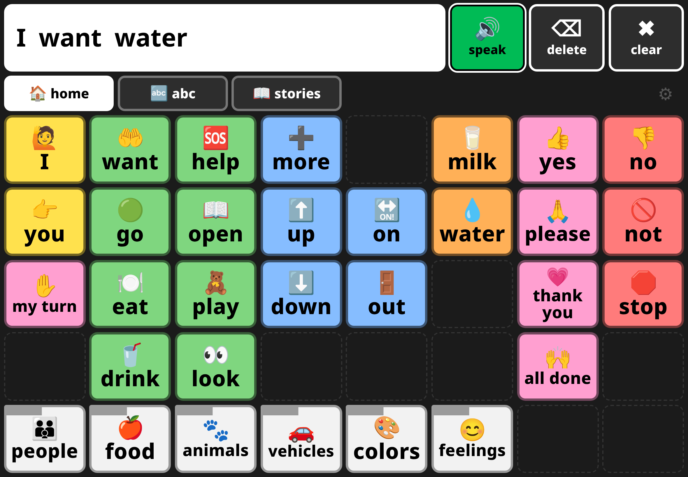

# ANOVA Language Dev: Word Board

A free, offline-capable **AAC** (augmentative and alternative communication) word board for
**iPad** and other tablets. It is a core vocabulary board with fixed button positions, a
spelling keyboard with word prediction, and simple read-along stories. It runs in the
browser as a web app: plain HTML/CSS/JS, no build step, no frameworks, no CDNs, no
analytics, no network calls.

It is meant for families of **nonspeaking** or minimally speaking children (for example
autistic children, toddlers with speech delays, and early readers) who want a low-cost
communication app to use at home. Buttons can hold single words or short phrases.

This repository is the **generic app shell** with a generic starter board and two sample
stories. Personal words, stories, photos and recordings go in a **personal pack** that is
imported on the device and stored only there (IndexedDB). Personal packs are never
committed to this repository.

**New here? Start with the step-by-step guide: [docs/SETUP.md](docs/SETUP.md).**

## About the name

"ANOVA" is a nod to *analysis of variance*, the statistics term. Language learning varies a
lot from child to child, especially for AAC users and early readers, and this board is built
to adapt to that variation rather than assume one path: adjustable word levels (Starter,
Middle, Full, Custom), custom packs of words and stories, and fixed button positions that
stay put as more words are revealed. The app does not do any statistical analysis.

## Cost and access

- **Dedicated speech-generating devices (SGDs)** often cost several thousand dollars. Two
  retail listings checked in October 2026: the Talk To Me Technologies Zuvo 10-D at
  [$7,900](https://evika.io/product/zuvo-10-d/) and the Tobii Dynavox I-15+ at
  [$12,040](https://evika.io/product/i-15/). Roughly $5,000–$15,000 is a fair, approximate
  range for many devices. Insurance and Medicaid usually require a formal evaluation by a
  speech-language pathologist (SLP), a prescription and prior authorization first (see for
  example the [MassHealth SGD guidelines](https://www.mass.gov/doc/guidelines-for-medical-necessity-determination-for-augmentative-and-alternative-communication-devices-including-speech-generating-devices/download)),
  and that process can take a while.
- **Commercial iPad AAC apps** cost a few hundred dollars. For example, Proloquo2Go is
  [$249.99 on the US App Store](https://apps.apple.com/us/app/proloquo2go-aac/id308368164)
  (checked October 2026).
- **This app is free.** Its source code is public, and it runs on an iPad you may already
  have, or a used one.

**Please read this:** Word Board is a free option to use at home and while you wait for a
device. It is **not** a replacement for an evaluation by a speech-language pathologist, and
it is not a medical device. Work with your child's SLP: they can help choose vocabulary,
teach modeling, and decide whether a dedicated device or a commercial app is the right fit.

*Search terms this project fits:* free AAC app, AAC for iPad, augmentative and alternative
communication, low-cost AAC, speech generating device alternative, communication app for
nonverbal or nonspeaking children, autism communication board, core vocabulary board,
communication app for toddlers, open source AAC (MIT license), early reader spelling
keyboard, phrase buttons for gestalt language processors.

## Features

Each of these describes what the current code does. Anything marked *can be extended* is not
built in yet.

1. **The word set grows with the child.**
   - **Words shown** levels in the parent screen: *Starter* (the most-used words; about 20–24
     on a full-size board), *Middle* (about 36–40), *Full* (every word) and *Custom* (tap words
     to show or hide them). The small generic starter board shows 17 of its 25 home words on
     Starter.
     Hidden words leave an empty cell, so visible buttons never move as words are revealed.
   - Each word can carry a `level` (1, 2 or 3) in the pack; otherwise a generic core-word
     default is used.
   - New words and new folders (category pages) are added in the pack file (`pack.json`):
     put a word in an empty cell, or add a page plus a folder button that points to it.
     On the iPad itself you can hide/show words and add photos; there is no on-screen word
     editor yet (*can be extended*).
2. **Easy to extend.** The whole app is a few plain JavaScript files with no build step.
   A developer could add a new tab or section, such as numbers or simple math, by adding a
   tab button in `index.html` and a view in `app.js` (the existing *home*, *abc* and
   *stories* tabs are examples). That is extending the open code; no such tab ships today.
3. **Personal stories with your own photos.** Each story page can show a photo: put it in
   the pack with the page's `pic` field, or add one on the iPad under
   *Parent settings → Stories: photos → Add photo* (camera or photo library). Pages can also
   show an emoji *scene* (2–6 emoji, main subject bigger) or a single emoji.
4. **Usage log (optional).** Off by default (*Parent settings → Usage log → keep a usage log*).
   When it is on, it records the **time and the word** for every word button tapped (each tap
   is also spoken) and every word typed on the keyboard once it is finished (with space or a
   prediction). It does not record the *speak* button, story pages, single letters or folder
   taps. The log stays in this browser's local storage on that device only (up to 20,000
   entries) and is never sent anywhere. *View log* shows the total, the 20 most-used words and
   the newest 200 entries with times; *Export CSV* / *Export JSON* save a file; *Clear log*
   deletes it. Use it to follow which words your child is using and learning.
5. **Built for real hands.** A press counts when the finger lifts, even after a long hold or
   a small wiggle; long-press menus and text selection are turned off.
6. **Works offline** once installed from an HTTPS address (Add to Home Screen).

## Screenshots

Generic board only (no personal pack), iPad size 820×1180 plus one landscape.

| | |
|---|---|
|  Home board |  Words collect in the message bar |
|  A folder (animals) |  abc keyboard with a typed question |
|  Stories list |  Story page with an emoji scene |
|  Parent settings: Words shown |  Parent settings: Import pack and the word editor |
|  Usage log (sample taps) |  Landscape |

## Run it

- **Set it up for a child:** follow [docs/SETUP.md](docs/SETUP.md) (free GitHub Pages hosting,
  Add to Home Screen, Guided Access, personal packs, updates).
- **Quick try on a computer:** in this folder run

  ```
  python3 -m http.server 8000
  ```

  then open `http://localhost:8000` in a browser.
- **Single file:** `node tools/build-single.js` writes `dist/aac.html` with everything
  inlined (see the limits under *Hosting*).

## What it does

- **Message bar** (top). Tapped words and letters collect here. **speak** says the whole
  message, **delete** removes the last word (on the keyboard it removes the last letter),
  **clear** empties the bar. Tapping the bar also speaks it. While speaking, the word being
  said is highlighted (when the voice reports word timing).
- **home (WORDS).** A fixed grid of word buttons. Tapping a word **speaks it right away and
  adds it to the bar**. Folder buttons (bottom row) open category pages. The **home** tab
  always sits in the same place and goes back to the home page.
- **abc (KEYBOARD).** A–Z in **alphabetical order**, **.** and **?**, plus a wide **space**
  bar. Pressing space speaks the finished word. **.** or **?** ends the last word; it shows in
  the message bar and stays in the spoken sentence (so **?** gets question intonation). The prediction row above the keys suggests words that start with the
  typed letters (from the visible buttons plus the pack's `knownWords`); tapping a
  suggestion finishes and speaks the word. It can be turned off.
- **stories.** Simple read-along books. **Turning a page never speaks.** The app speaks only
  when a word is tapped (that word) or **▶ read** is tapped (the page). There are big
  back/next arrows on both sides. This fits an adult reading aloud and pointing.
  Each page can show a photo (`pic`), a small emoji **scene** (`scene`, 2–6 emoji, the main
  subject bigger) or one big `emoji`. The **stories** tab always opens the list of stories,
  laid out so every tile fits on screen when possible.
- **Presses.** A button counts when the finger lifts, however long it was held, as long as the
  finger is still on the button or within about 28 px of it. Slow presses, holds and wiggles
  all work; sliding well off the button cancels. Long-press menus and text selection are off.
- **Words shown** (parent settings, top section): **Starter** (about 20–24 most-used words),
  **Middle** (about 36–40), **Full** (every word) or **Custom** (tap words in the editor to show or
  hide them). Words are **masked, never moved**: a hidden word leaves an empty cell, so every
  visible button keeps its place as more words are revealed. Folder buttons always show; the level
  applies to Home, and optionally inside folders too. Each word's priority comes from its optional
  `level` field (1 = starter, 2 = middle, 3 = full) or a generic core-word default. A pack can set
  its default with `config.wordsShown`; once a parent picks a level it is saved on the device and
  kept when a pack is imported again.
- **Parent settings** (hold the dim ⚙ gear for 2 seconds; triple tap is optional):
  voice, speed, pitch, volume; text case; pictures on/off; prediction; tap-repeat guard;
  story read mode; personal pack import/export; hide/show words; add photos from the
  camera or photo library; opt-in usage log.

No animations, no ads, no sounds except speech and recordings.

## Colour coding (modified Fitzgerald key)

| Colour | Group | Examples |
|---|---|---|
| yellow | people / pronouns | I, you, mom, me |
| green | verbs (actions) | want, go, help, eat |
| blue | descriptors: describing, location, colour, feeling words | more, up, on, red, happy |
| orange | nouns (things) | milk, water, cat, car |
| pink | social words | yes, please, thank you, all done, my turn |
| red | negation / stop | no, not, stop |
| white | little words (`type: "little"`) | and, the |
| white with a black tab | folder (opens a category page) | animals, food |

Location words (up, down, on, out) are shown blue with the descriptors, and **stop** is red
with the negation words, as many core boards do. Change a word's `type` to recolour it.

## Motor planning: positions never move

Every button has an explicit `row`/`col` on a fixed grid (5 × 8 by default). Empty cells
stay blank. Hiding a word blanks its cell and moves nothing else. Adding a word only fills
an empty cell. Keep these rules when editing:

1. Never change the `row`/`col` of a word the user already knows.
2. Put new words only into empty cells. Parent settings → *Words* shows every empty cell
   as `r4 c1` etc.
3. To remove a word for a while, hide it instead of deleting it.

The app checks the layout when it loads. Two words in one cell, a cell outside the grid,
or a folder pointing to a missing page is listed in parent settings and in the console,
and the first word keeps the cell.

## Editing words

**Generic board:** `words.js` (comments at the top explain every field).

**Personal board:** edit the pack's `pack.json`. It uses the same `pages`/`words` format
under `config`. Rebuild the pack and import it again (see below).

```js
{ id: "juice", label: "juice", page: "food", row: 1, col: 5, type: "noun", emoji: "🧃" }
```

Optional fields:
- `say`: what the voice says if it should differ from the label. The starter board uses
  `say: "eye"` on **I**, because iOS reads a lone "I" as "capital I". The app also applies
  "eye" to a typed **i** and to "I" in stories, even if a pack forgets the `say` field.
- `audio`: a recording, e.g. `"recordings/milk.m4a"`. If the recording is in the pack it
  plays; if it is missing or cannot play, the voice says the word instead.
- `image`: a photo, e.g. `"photos/cup.jpg"` (or add one on the iPad).
- `hidden: true`.

## Personal packs

A pack is either a `.zip` (holding `pack.json` plus `photos/…` and `recordings/…`) or a
single `.json` with the media embedded. `pack.json` looks like this:

```json
{ "format": "wordboard-pack", "version": 1, "name": "My pack",
  "config": { "pages": [...], "words": [...], "knownWords": ["cat", "dog"], "wordsShown": "starter" },
  "stories": [ { "id": "s1", "title": "…", "emoji": "🚌", "pages": [ { "text": "…", "scene": ["🐶", "👀", "🌧️"], "sceneMain": 2, "emoji": "🌧️" },
                                                                 { "text": "…", "pic": "photos/p1.jpg" } ] } ],
  "includeSampleStories": true }
```

To build importable files from a pack folder:

```
node tools/make-pack.js <pack-folder> <out-folder> <name>
```

This checks the pack for position collisions and writes `<name>.zip` and `<name>.json`.

**On the iPad:** open the app → hold ⚙ for 2 s → *Import pack* → choose the file in Files.
Import in the **Home Screen app itself**: iOS keeps Home Screen web apps' storage separate
from Safari's. After importing, photos can be added under *Words* (choose "add or change
its photo" and tap a word) or under *Stories*. **Export pack (.zip)** or **Share / Save to
Files** makes a backup with all photos and recordings. Back up after changes: deleting the
Home Screen app can delete its storage.

Recordings: record in Voice Memos, share/save as `.m4a`, name it like the word
(`milk.m4a`), put it in the pack's `recordings/` folder, add `audio: "recordings/milk.m4a"`
to the word, then rebuild and re-import.

## Speech notes (iOS)

- Speech uses the Web Speech API (`speechSynthesis`) in en-US and needs no network for
  on-device voices.
- iOS loads voices late and doesn't always fire `voiceschanged`. The app polls for about
  10 s, and until voices appear it speaks with the default en-US voice.
- iOS only allows speech/audio to start from a tap. Every sound starts from a tap. The app
  also primes the audio engine on the first touch, so a recording followed by speech works.
- **Siri voices are not available to web apps.** For a nicer voice, download an *Enhanced*
  or *Premium* English voice: iPad **Settings → Accessibility → Spoken Content → Voices →
  English**. Then pick it under ⚙ → Voice (or leave it on *Automatic*, which prefers
  Premium/Enhanced en-US voices). Novelty voices are hidden unless you ask for them.
- Rate and pitch feel different from voice to voice; some iOS voices ignore pitch.
- Word highlighting while speaking depends on the voice sending word-boundary events. If
  highlighting drifts in stories, set *Stories ▶ read button* to "one word at a time".
- Turn the iPad volume up. Speech and recordings follow the media volume.

## Hosting

"Add to Home Screen" (Safari → Share → Add to Home Screen) gives a full-screen app icon.
Working **offline** needs the service worker, and browsers only run service workers on
**https://** (or `localhost`).

**(a) Local server on the home network.** Easiest to try:
`python3 -m http.server 8000` in this folder, then open `http://<computer-ip>:8000` on the
iPad. Plain `http://` to a LAN address is **not a secure context**, so there is no service
worker and no offline use. The app works only while the computer is serving, and a pack
imported on a plain-http address also lives on that address. For offline use on the LAN,
serve it over HTTPS with a certificate the iPad trusts, for example a private network
tool such as [Tailscale](https://tailscale.com) (`tailscale serve`), which gives an HTTPS
address that only your own devices can reach. After the first load it works with no network.

**(b) A static HTTPS host.** Any static host works (for example GitHub Pages or Cloudflare
Pages). HTTPS means the service worker runs, so it works offline after the first visit. If
you want to limit who can open it, put it behind a login (for example Cloudflare Access or
basic-auth); log in once in Safari, then Add to Home Screen. Login redirects can misbehave
inside a Home Screen app, so load it once while logged in; after that it runs from the
offline cache. Only the generic shell is on the host. Personal content stays on the device.

**(c) One self-contained HTML file** (`dist/aac.html`, built with
`node tools/build-single.js`). Everything is inlined in one file with no external requests.
Limits on iPad:
- The Files app's preview (Quick Look) **does not run JavaScript**, and current iPadOS
  Safari won't open local HTML files. So an AirDropped `aac.html` does **not** work by
  tapping it in Files. It needs a third-party app with a real web view (for example an
  "HTML viewer" app), and whether speech works there depends on that app.
- There is **no service worker** from a file, so there is no install/offline caching. It is
  "offline" only in the sense that the file itself needs no network.
- The single file is still handy to put on a host as one file (option b), where
  it behaves like the normal app minus offline caching.

## Files

| File | What it is |
|---|---|
| `index.html` | app page |
| `styles.css` | layout and colours |
| `app.js` | app logic (speech, grid, keyboard, stories, parent mode, packs) |
| `store.js` | on-device storage (IndexedDB) and a small zip reader/writer |
| `words.js` | generic starter board |
| `stories.js` | generic sample stories |
| `sw.js` | service worker (offline) |
| `manifest.json`, `icons/` | Home Screen install |
| `tools/make-pack.js` | builds a pack `.zip`/`.json` from a pack folder |
| `tools/build-single.js` | builds `dist/aac.html` |
| `tools/icon.html` | icon source |
| `dist/aac.html` | single-file build |
| `docs/SETUP.md` | step-by-step setup guide for parents |
| `docs/example-pack/pack.json` | tiny example pack (generic) |
| `docs/screenshots/` | screenshots of the generic board |

## Privacy

Personal packs (words, stories, photos, recordings, the usage log) stay on the device where
they are imported and are never part of this repository. Don't commit `pack.json` files,
pack `.zip`/`.json` builds, photos or recordings here; keep them somewhere private and
import them on the device.

## Updating

After changing app files, reopen the app twice: the first launch fetches the update in
the background and the second shows it. **Bump `CACHE` in `sw.js` on every release** so
devices drop the old offline copy.

## Tip: Guided Access

iPad **Settings → Accessibility → Guided Access** locks the iPad into this app (triple-click
the side/top button to start it). It stops accidental exits.

## License

MIT. See [LICENSE](LICENSE). Free to use, change, and share, with no warranty.
